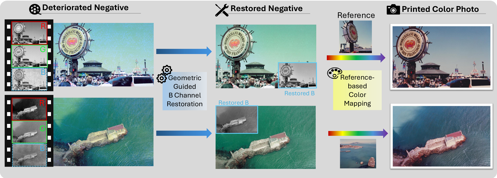

# Negative Restoration via the Heterogeneity of Channel-Induced Geometric Features

[](assets/teaser.pdf)

Restore degraded negatives using geometric differences between channel-induced views, then reconstruct printed colors from a reference image. Both stages use frozen **Depth Anything 3** features (L13 for restoration, L19 for color mapping) and lightweight NAF networks.

The release contains two separate stages: `restoration` restores the degraded negative without reference-based color mapping; `color_mapping` is the optional second stage that transfers printed colors from a reference image.

## ⚙️ Installation

Use Python 3.11 and a CUDA GPU. Run commands from this directory.

```bash
conda create -n negative-restoration python=3.11 -y
conda activate negative-restoration
pip install torch==2.7.1 torchvision==0.22.1 --index-url https://download.pytorch.org/whl/cu118
pip install -e .
pip install -c requirements.txt xformers==0.0.31.post1 'git+https://github.com/ByteDance-Seed/Depth-Anything-3.git@3d835ec1a5802d64a8b8b15f817a1ab54809bfe4'
```

The feature extractor loads `depth-anything/DA3NESTED-GIANT-LARGE`. Set `da3.model_id` in the YAML files to a local DA3 model directory for offline use. CUDA requirements depend on image resolution; full-resolution feature extraction can use substantial GPU memory.

## 📥 Pretrained weights

Download checkpoints from [Hugging Face](https://huggingface.co/sharron2/Negative-Restoration-via-the-Heterogeneity-of-Channel-Induced-Geome):

| Stage | File | Link |
| --- | --- | --- |
| Restoration | `restoration.pt` | [download](https://huggingface.co/sharron2/Negative-Restoration-via-the-Heterogeneity-of-Channel-Induced-Geome/resolve/main/restoration.pt) |
| Color mapping | `color_mapping.pt` | [download](https://huggingface.co/sharron2/Negative-Restoration-via-the-Heterogeneity-of-Channel-Induced-Geome/resolve/main/color_mapping.pt) |

```bash
mkdir -p checkpoints
huggingface-cli download sharron2/Negative-Restoration-via-the-Heterogeneity-of-Channel-Induced-Geome \
  restoration.pt color_mapping.pt --local-dir checkpoints
```

## 📦 Data preparation

Download [BlueNeg](https://huggingface.co/datasets/ttgroup/blueneg-release):

```bash
huggingface-cli download ttgroup/blueneg-release --repo-type dataset --local-dir /path/to/blueneg-release
```

Generate manifests from the BlueNeg directory layout:

```bash
python -m negative_restoration.manifests --data-root /path/to/blueneg-release
```

This uses the training and gradually degraded pairs for restoration, and the non-PS input/reference/target pairs for color mapping.

Then extract frozen DA3 caches before training (L13 for restoration, L19 for color mapping):

```bash
python -m negative_restoration.prepare --config configs/restoration.yaml --split train
python -m negative_restoration.prepare --config configs/restoration.yaml --split val
python -m negative_restoration.prepare --config configs/color_mapping.yaml --split train
python -m negative_restoration.prepare --config configs/color_mapping.yaml --split val
```

## 🚀 Training

```bash
python -m negative_restoration.train --config configs/restoration.yaml
python -m negative_restoration.train --config configs/color_mapping.yaml
```

Edit data paths and training parameters in `configs/`. Resume with `--resume runs/restoration/last.pt` or `--resume runs/color_mapping/last.pt`. Training writes local metrics and validation images to `runs/`. Both stages use L1 + FFT-L1 (`fft_weight: 0.125`).

## 🔮 Inference

Restore one image using your trained model:

```bash
python -m negative_restoration.infer \
  --config configs/restoration.yaml \
  --checkpoint checkpoints/restoration.pt \
  --input /path/to/negative.png --output outputs/restored.png
```

To process a directory, pass directories to both `--input` and `--output`.

Map the restored image to a reference's printed colors:

```bash
python -m negative_restoration.infer \
  --config configs/color_mapping.yaml \
  --checkpoint checkpoints/color_mapping.pt \
  --input outputs/restored.png --reference /path/to/reference.png \
  --output outputs/printed.png
```

Features are extracted automatically. Outputs retain the input image dimensions.

## 🙏 Acknowledgments

Many thanks to [R2R](https://github.com/cscxwang/R2R), [Depth Anything 3](https://github.com/ByteDance-Seed/Depth-Anything-3), and [NAFNet](https://github.com/megvii-research/NAFNet).
